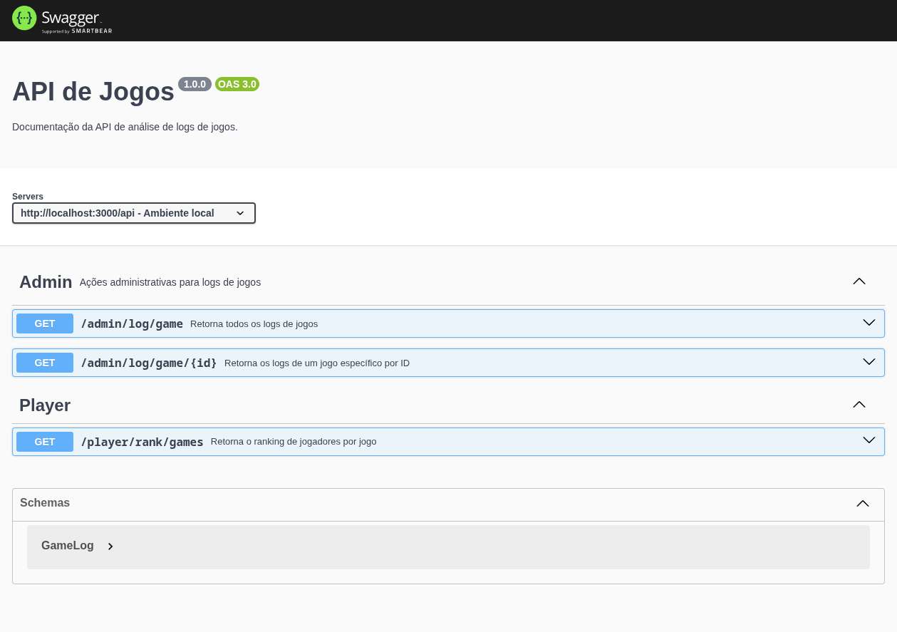
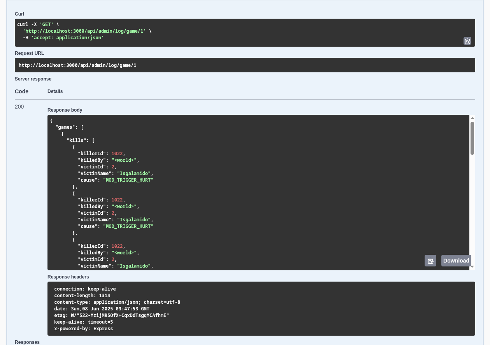
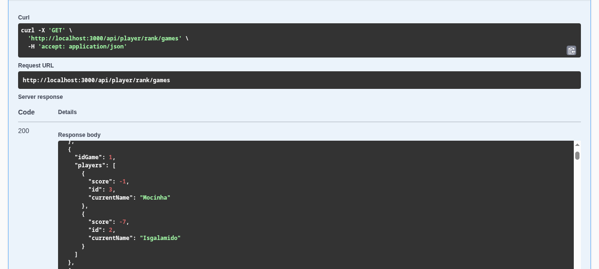

# Quake Log Parser API Node/TypeScript

Este projeto é uma API desenvolvida para processar e expor estatísticas e rankings de partidas de Quake com base em arquivos de log. Ele foi criado como parte de um exercício técnico para uma vaga de backend.

---

## Histórias

Essa API processa logs de partidas do jogo Quake para gerar estatísticas de jogo e rankings de jogadores, conforme as seguintes histórias de usuário:

* **História 1:** Estatísticas por jogo: total de mortes, mortes por causa e mortes causadas pelo `<world>`.
* **História 2:** Ranking dos jogadores de cada partida com pontuação baseada em kills e mortes pelo mundo.
* **História 3:** Consulta das estatísticas de jogos específicos ou de todos os jogos via API para visualização.

---

## Tecnologias

* **Linguagem:** TypeScript
* **Framework:** ExpressJS
* **Banco de Dados:** Redis (para armazenamento em cache/dados de jogos)
* **Documentação API:** Swagger em `/api-docs`
* **Containerização:** Docker + Docker Compose com Redis e Node.js

---

## Estrutura do Projeto (Resumo)

```
src/
├── Application/        # Serviços, DTOs, Mappers e UseCases
├── Domain/             # Modelos, Enums e Interfaces do domínio
├── Incoming/           # Configurações, Controllers e Rotas HTTP
├── Infrastructure/     # Configuração do Redis, Logger e Repositórios
├── index.ts            # Ponto de entrada da aplicação
```

---

## Exercício

**Exercício:** Quake Log Parser


## Prints e Evidências

### Swagger Documentation


### Resultado de Estatísticas de Jogos


### Resultado de Ranking


---

## Como testar e rodar a aplicação

### Usando Docker (recomendado)

1. Suba a aplicação com:
```bash
docker-compose up --build
````

2. Acesse:

   * API: `http://localhost:3000`
   * Swagger: `http://localhost:3000/api-docs`

---

### Rodando localmente (sem Docker)

1. Instale dependências:

```bash
npm install
```

2. Inicie o servidor:

```bash
npm run dev
```

> Certifique-se de que o Redis esteja rodando localmente na porta `6379`.

---

### Testando via Postman

👉 [Collection Postman](./postman/Quake%20Log%20Parser%20API.postman_collection.json)


Ou use os endpoints diretamente:

| Método | Endpoint                      | Descrição                      |
| ------ | ----------------------------- | ------------------------------ |
| GET    | `/api/admin/log/game`         | Estatísticas de todos os jogos |
| GET    | `/api/admin/log/game/:gameId` | Estatísticas de um jogo por ID |
| GET    | `/api/player/rank/games`      | Ranking dos jogadores          |

---

## Observações sobre o processo

### Dificuldades

* Criar o parser de logs exigiu atenção aos detalhes da formatação das strings.
* Garantir a persistência de dados com Redis e manter estrutura limpa foi desafiador com o tempo limitado.

### Reflexões

* Esse foi um exercício bastante interessante, pois exigiu não apenas codificação, mas também pensamento arquitetural. Tive liberdade para aplicar boas práticas de desenvolvimento, como a separação clara de camadas (Domain, Application, Infrastructure), uso de interfaces, mappers e DTOs. Seguindo princípios da Clean Architecture.

* Como desenvolvedor experiente, compreendo os riscos de adicionar dependências desnecessárias ou utilizar frameworks mais recentes apenas por conveniência. Embora conheça diversas ferramentas modernas como NestJS, prefiro evitar dependências que possam comprometer a manutenção ou estabilidade do projeto, especialmente em soluções que precisam ser simples, claras e confiáveis.

---

## Comentários Finais

Gostei bastante da proposta! Foi uma ótima oportunidade para aplicar princípios que valorizo: código limpo, arquitetura bem definida, versionamento, logging estruturado e documentação clara.

Se tivesse mais tempo, com certeza teria incluído testes unitários mais robustos e até um painel web (com Next.js ou outras tecnologias que domino) para visualização gráfica em tempo real dos rankings por partida. Tenho várias ideias de melhorias que poderiam transformar esse parser em uma solução completa e escalável.